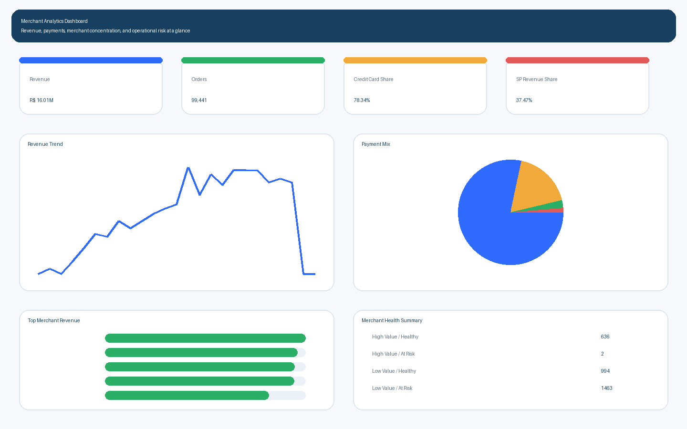
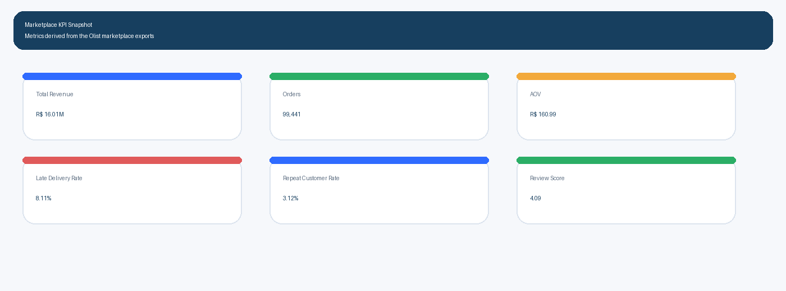
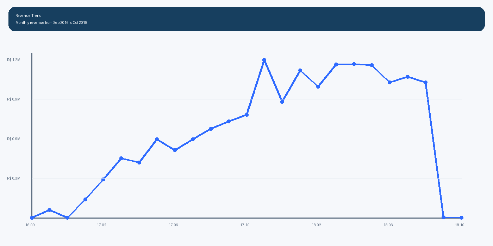
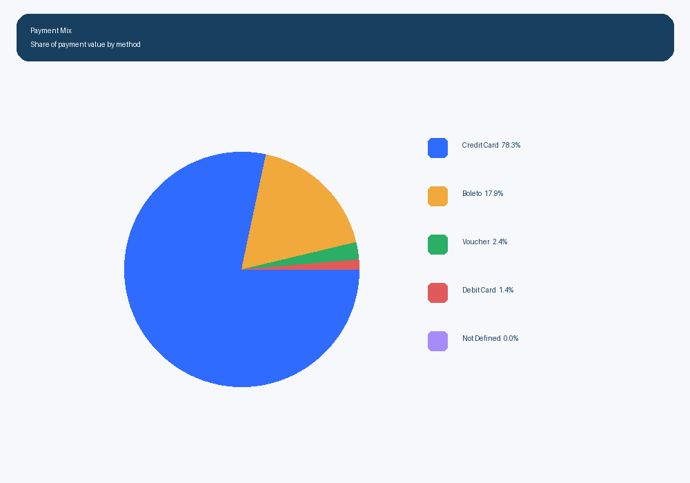
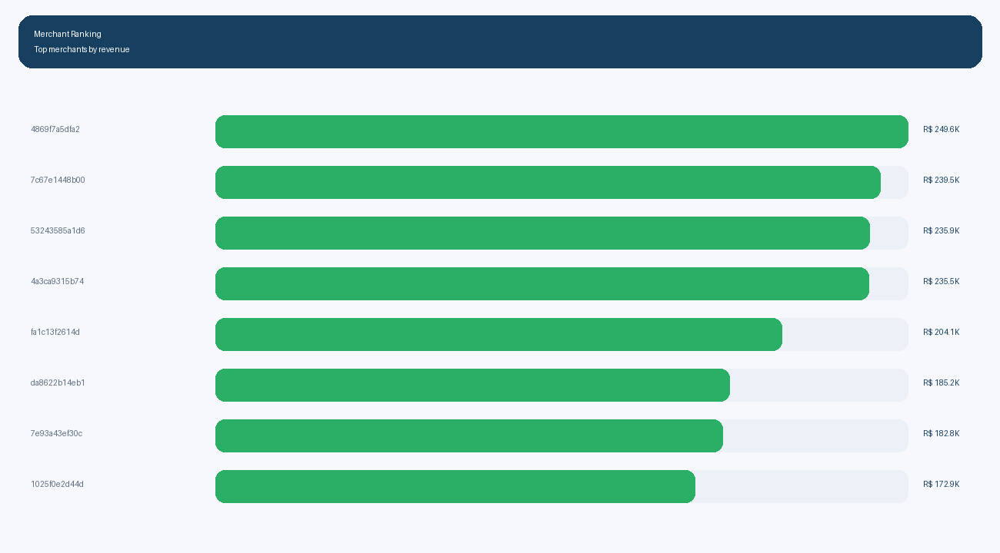
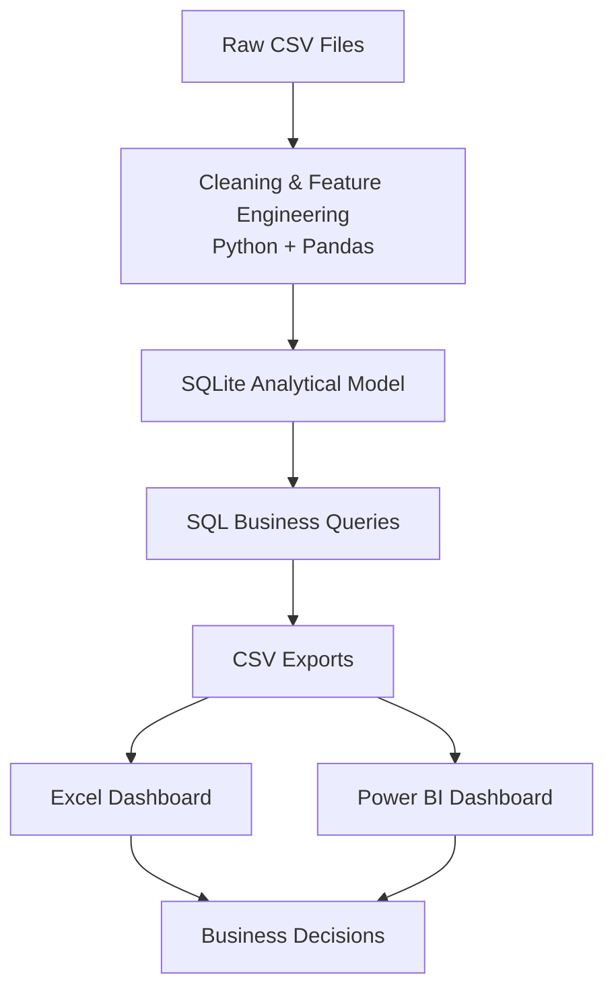

# Merchant Analytics Dashboard: SQL, Excel & Python Business Intelligence

An end-to-end analytics project built on the **Brazilian E-Commerce Public Dataset by Olist** to analyze revenue, payments, merchant performance, customer retention, and delivery operations.

## Screenshots











## Key Insights

- Top 5% of merchants generated **52.51%** of total revenue.
- Credit cards accounted for **78.34%** of payment value.
- Weekday average order value was **1.33%** higher than weekends.
- Late deliveries affected **8.11%** of delivered orders, and late orders arrived **9.55 days** behind estimate on average.
- Sao Paulo contributed **37.47%** of total revenue.
- The merchant risk logic flagged **223** above-average-revenue merchants for intervention.

## Architecture



## Why This Project

This project is structured like a business analytics workflow rather than a notebook-only exercise. It focuses on questions such as:

- Which merchants drive the most revenue?
- How concentrated is marketplace revenue?
- Which payment methods dominate transaction value?
- Where are delivery delays and cancellations creating risk?
- Which merchants are healthy versus high value but operationally fragile?

## Tech Stack

- Python
- Pandas
- SQL
- SQLite
- Excel
- Power BI
- Git

## Dataset

Source dataset: **Brazilian E-Commerce Public Dataset by Olist**

Tables used:

- customers
- sellers
- products
- orders
- order items
- payments
- reviews
- geolocation
- product category translation

Setup instructions: [data/README.md](data/README.md)

## Project Structure

```text
merchant-analytics-dashboard/
├── data/
│   ├── raw/
│   ├── processed/
│   ├── exports/
│   └── README.md
├── database/
├── excel/
├── images/
├── powerbi/
├── python/
├── sql/
├── .gitignore
├── README.md
└── requirements.txt
```

## Workflow

1. Put the raw Olist CSV files in `data/raw/`.
2. Run [python/clean_data.py](python/clean_data.py) to clean the data, engineer features, and build the SQLite database.
3. Run [python/analysis.py](python/analysis.py) to generate chart-ready and dashboard-ready CSV exports.
4. Build the Excel dashboard manually from `data/exports/`.
5. Optionally connect the same exports to Power BI.

Run commands:

```powershell
python python/clean_data.py
python python/analysis.py
```

## SQL Layer

Core files:

- [sql/schema.sql](sql/schema.sql)
- [sql/analysis.sql](sql/analysis.sql)

The SQL analysis covers:

- revenue and order trends
- payment method distribution
- merchant ranking and revenue concentration
- customer lifetime value and cohort retention
- review quality and delivery performance
- merchant health scoring
- intervention candidate identification

## Python Layer

[python/clean_data.py](python/clean_data.py) handles:

- missing-value-safe parsing
- duplicate removal
- datetime conversion
- feature engineering for month, weekday, weekend, delivery days, and delay days
- translation joins for product categories
- cleaned CSV exports
- SQLite database creation

[python/analysis.py](python/analysis.py) exports:

- KPI summary
- monthly revenue
- payment mix
- top merchants
- revenue by state
- delivery summary
- review distribution
- category performance
- merchant health
- intervention candidates
- retention cohorts

## Merchant Health Score

The project includes a merchant scoring layer that combines:

- revenue contribution
- review quality
- late delivery rate
- cancellation rate

This segments merchants into:

- `High Value / Healthy`
- `High Value / At Risk`
- `Low Value / Healthy`
- `Low Value / At Risk`

That makes the project more actionable than a static dashboard because it identifies which merchants need support, monitoring, or escalation.

## Excel Dashboard

The Excel deliverable is intended to be built manually from the exports in `data/exports/`.

Suggested tabs and visuals are documented in [excel/README.md](excel/README.md).

## Power BI

Suggested Power BI pages are documented in [powerbi/README.md](powerbi/README.md).

## Deliverables

- cleaned CSVs in `data/processed/`
- SQLite database in `database/merchant_analytics.db`
- chart-ready exports in `data/exports/`
- dashboard screenshots in `images/`
